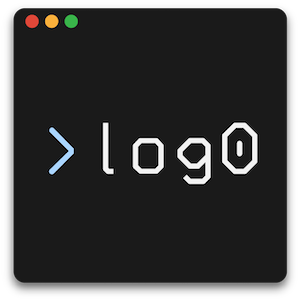

# log0
Simple logging for Go.
___

[](https://travis-ci.org/danielkov/log0)
[](https://coveralls.io/github/danielkov/log0?branch=master)
[](https://goreportcard.com/report/github.com/danielkov/log0)
[](https://godoc.org/github.com/danielkov/log0)
[](http://opensource.org/licenses/MIT)

`log0` is a simple logging adapter that simply provides clean and convenient methods for logging. It uses `bufio.Writer` as the output for the performance benefits of buffered writes as well as compatibility with any `io.Writer`.

The simplest way to use it is via `Default()`, which creates a `Logger` instance that uses `os.Stdout` as the output.

```golang
var log = log0.Default()

func main() {
    // calls Flush() on the bufio.Writer
    defer log.Close()
    log.Info("This message should print at the 'INFO' level.")
}
```

Here is an example of the default logging format:

```txt
Sat Jan 20 13:04:54 CET 2018 [INFO] - This should print. :: main.go:10 -> main.main
Sat Jan 20 13:04:54 CET 2018 [WARN] - Calling log from private function. :: main.go:16 -> main.privateFunc
Sat Jan 20 13:04:54 CET 2018 [ERROR] - Calling log from public function. :: main.go:20 -> main.PublicFunc
```

You can use any `bufio.Writer` and as such it can be a drop-in replacement for current solutions. This opens up the possibility to make use of features, like buffer limit, with no added cost.

## Stack trace

The default logger created with `Default()` scans the stack trace for each individual log, to retrieve information about file name, line number and function name. This is a run-time operation, which is quite expensive, so it can be turned off via the `ShowTrace` boolean.

The trace is a `runtime.Frame` of the scope which called the logger method.

## Formats

 - `default` log format is constructed in the following manner:

```txt
<time(UNIXDate)> [<level>] - <message> :: <filename>:<line> -> <function>
```

 - `simple` log format follows this pattern:

```txt
<time> [<level>] <function> - <message>
```

## Levels

The methods will only actually write logs if the logging level is included in the `Levels` of the logger. The following levels are available:

 - `FINEST`
 - `FINE`
 - `DEBUG`
 - `TRACE`
 - `INFO`
 - `WARNING`
 - `ERROR`
 - `CRITICAL`

There are 3 methods to set the logging level dynamically:

### `Level()`

This method sets the logging level, which includes the level set and all levels above, e.g.: setting to `DEBUG` will include: `DEBUG`, `TRACE`, `INFO`, `WARNING`, `ERROR` and `CRITICAL`.

```golang
// comes with logging level of INFO
var log = log0.Default()

func main() {
    // Sets level to DEBUG
    log.Level(log0.DEBUG)
}
```

### `Include()`

This method adds any number of log levels to the `Levels` of the logger, e.g.: adding `DEBUG` to the default list of `INFO` - `CRITICAL`.

```golang
var log = log0.Default()

func main() {
    log.Include(log0.DEBUG)
}
```

### `Exclude()`

This method can be used to silence a specific level, by removing it from the `Levels`, e.g.: removing `ERROR` from the default list leaves: `INFO`, `WARNING` and `CRITICAL`.

```golang
var log = log0.Default()

func main() {
    log.Exclude(log0.ERROR)
}
```

## Contributing

Bug reports and pull requests are welcome!

## License

Copyright 2018 Daniel Emod Kovacs

Permission is hereby granted, free of charge, to any person obtaining a copy of this software and associated documentation files (the "Software"), to deal in the Software without restriction, including without limitation the rights to use, copy, modify, merge, publish, distribute, sublicense, and/or sell copies of the Software, and to permit persons to whom the Software is furnished to do so, subject to the following conditions:

The above copyright notice and this permission notice shall be included in all copies or substantial portions of the Software.

THE SOFTWARE IS PROVIDED "AS IS", WITHOUT WARRANTY OF ANY KIND, EXPRESS OR IMPLIED, INCLUDING BUT NOT LIMITED TO THE WARRANTIES OF MERCHANTABILITY, FITNESS FOR A PARTICULAR PURPOSE AND NONINFRINGEMENT. IN NO EVENT SHALL THE AUTHORS OR COPYRIGHT HOLDERS BE LIABLE FOR ANY CLAIM, DAMAGES OR OTHER LIABILITY, WHETHER IN AN ACTION OF CONTRACT, TORT OR OTHERWISE, ARISING FROM, OUT OF OR IN CONNECTION WITH THE SOFTWARE OR THE USE OR OTHER DEALINGS IN THE SOFTWARE.